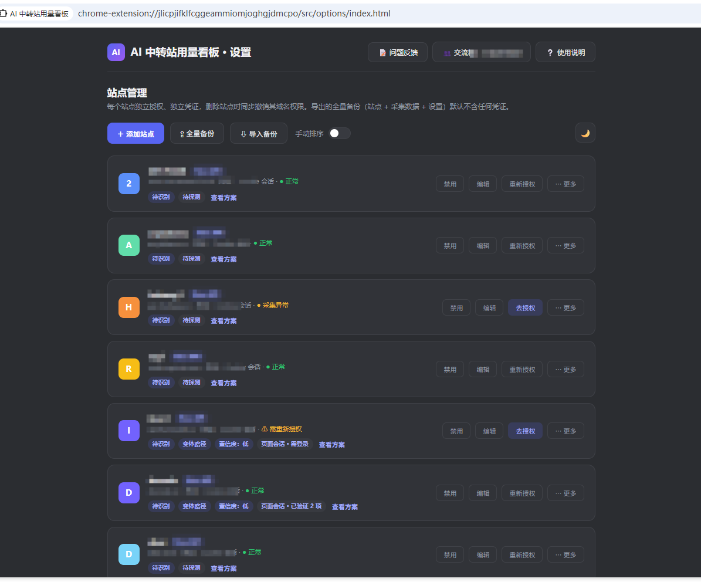
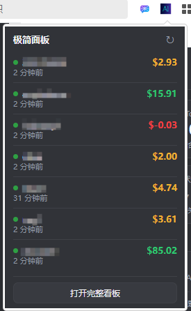
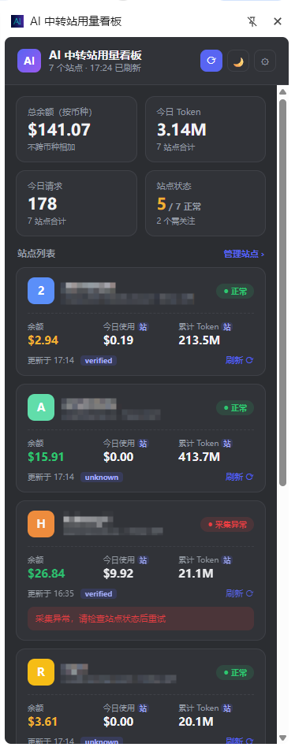

# AI 中转站用量看板 · AI Relay Usage Dashboard

<p align="center">
  
</p>

<p align="center">
  <b>一个 Chrome MV3 侧边栏插件，集中查看多个 AI API 中转站的余额、真实用量和本地历史。</b><br>
  本地优先 · 动态权限 · 不保存凭证 · 不模拟数据
</p>

## 功能概览

- 汇总所有已启用站点的余额、今日 Token、请求数和状态；金额按币种分组，不跨币种相加。
- 复用浏览器中已登录站点的 Cookie 会话采集数据；登录态失效时提示重新登录。
- 展示单站余额历史、今日用量、模型分布、请求趋势和站点接口返回的耗时信息。
- 支持手动刷新和按间隔自动采集；历史保留天数可配置。
- 提供数据浏览器，可查看快照、每日统计和自定义采集记录。
- 支持全量备份与还原，备份不包含 Cookie、Token、密码或其他凭证。
- 支持同源 GET 自定义采集、脱敏诊断日志导出，以及浅色、深色和跟随系统主题。

> 数据原则：今日用量和趋势只使用站点可核验的 usage / log 接口。站点没有准确接口时，插件显示 `—`，不会用余额差分或模拟数据补全。

## 安装与加载

1. 安装依赖：

   ```bash
   npm install
   ```

2. 检查并构建：

   ```bash
   npm run typecheck
   npm run build
   ```

3. 打开 Chrome `chrome://extensions/`，启用「开发者模式」。
4. 点击「加载已解压的扩展程序」，选择项目生成的 `dist/` 目录。
5. 重新构建后，在扩展管理页点击该扩展的重新加载按钮即可应用新版本。

## 普通用户手动下载 ZIP 安装

普通用户不需要安装 Node.js、npm 或执行构建命令，直接下载已经打包好的 ZIP 即可使用。发布后的压缩包可从 [GitHub Releases 下载页](https://github.com/shanyuyulai/AI_Relay_Usage_Dashboard/releases) 获取，例如 `AI_Relay_Usage_Dashboard_v0.3.10.zip`。

1. 下载对应版本的 ZIP 文件，并解压到一个长期保留的目录。不要直接在压缩包内运行，也不要解压后立即删除目录。
2. 打开 Chrome 的 `chrome://extensions/`，或 Edge 的 `edge://extensions/`，启用右上角「开发者模式」。
3. 点击「加载已解压的扩展程序」，选择解压后的顶层目录。正确目录应当能直接看到 `manifest.json`、`src/`、`assets/` 和图标文件；不要选择 ZIP 文件，也不要选择它的父目录。
4. 加载成功后，点击浏览器工具栏的扩展图标，将插件固定到工具栏，再打开插件设置页添加站点。
5. 在普通标签页登录各个中转站，回到插件执行授权测试或「立即同步」。插件不会从 ZIP 中获得站点登录状态，Cookie、Token 和密码也不会被压缩包保存。

### ZIP 版本更新

更新前建议在插件设置页执行「全量备份」，保存站点配置和历史数据。下载新版本后，解压到新的目录，再回到扩展管理页移除旧的开发者版本并加载新目录；随后重新登录站点并使用「全量备份」还原数据。若希望保留原扩展的本地数据，应在同一路径替换文件后点击扩展管理页的「重新加载」，不要同时加载多个副本。

### 发布 ZIP 供用户下载

推荐使用 GitHub Releases：在仓库创建 `v0.3.10` 标签或 Release，将项目目录中的 `AI_Relay_Usage_Dashboard_v0.3.10.zip` 作为 Release Asset 上传，发布后把 Release 页面链接放入 README。用户从 Releases 页面下载 ZIP，按上面的「加载已解压的扩展程序」步骤安装。也可以使用你自己的文件服务器或网盘，但应确保链接可下载原始 ZIP，且每个版本保留独立文件名和校验信息。

## 界面预览

以下截图展示设置页、极简面板和完整侧边栏的实际使用界面：

### 设置页



### 极简面板



### 完整侧边栏



## 添加站点

1. 先在普通浏览器标签页登录目标中转站，确保 Cookie 会话有效。
2. 打开扩展的「设置」页，点击「添加站点」。
3. 填写站点名称、面板 URL、适配器、计价货币和颜色。
4. 保存时 Chrome 会为该站点 origin 请求访问权限；允许后执行授权测试。
5. 返回侧边栏，使用「全部刷新」或单站刷新读取最新数据。

每个站点独立申请权限、独立维护登录状态。删除站点会撤销对应站点权限并清理该站点的本地数据。

## 日常使用

- **侧边栏**：查看全部站点概览；点击站点卡片进入详情，查看余额、趋势、模型分布和当日用量明细。
- **自动采集**：在设置页的数据浏览器中设定关闭、5/15/30/60 分钟或自定义间隔。默认间隔为 30 分钟。
- **数据保留**：可选择保留 7、30、90 天或永久保存。清理只影响采集历史，不删除站点配置。
- **自定义采集**：每个站点可配置以英文分号分隔的同源 GET 路径，采集当前登录会话可访问的 JSON 响应；支持导出或清空这些记录。
- **诊断日志**：用于排查采集问题，日志只保存端点、状态码、字段类型和耗时等脱敏信息，可导出 JSON 或清空。
- **实验室功能**：零标签后台采集、动态 CORS 放行、极简用量面板均为实验性能力，默认关闭；启用前请阅读界面提示。

## DoCode 余额与诊断（v0.3.10）

使用 DoCode 前，请在普通标签页保持登录 [DoCode 控制台](https://docode.cc/console)，再在插件中执行「立即同步」。v0.3.10 按 DoCode 当前接口语义换算金额：

- `/api/user/self` 中的 `quota` 是当前可用额度，`used_quota` 是历史消耗额度，`request_count` 是累计请求数。
- `/api/status` 中的 `quota_per_unit` 是额度换算单位；当前 USD 示例为 `500000`。因此余额为 `quota / quota_per_unit`，历史消耗为 `used_quota / quota_per_unit`。
- `quota` 与 `used_quota` 不是可相减的同一时点余额；插件不会再使用 `quota - used_quota`。例如 `42510000 / 500000 = $85.02`，而 `42510000 - 9656930 = 32853070` 是错误的原始额度差值，不能显示为美元余额。

升级后请在 `chrome://extensions/` 重新加载插件，保持控制台登录并执行「立即同步」。导出的最新诊断应包含 `/api/status`，且会记录已取得余额单位配置并按 `quota_per_unit` 换算。此前写入的错误历史值不会自动改写；请在设置页的余额历史列表删除对应旧记录后重新采集。

## 全量备份与还原

设置页的「全量备份」会生成 v2 JSON 文件，包含：

- 站点配置
- 余额快照、每日用量和当日用量明细
- 自定义采集记录与脱敏诊断日志
- 可移植的用户设置

备份明确不包含 Cookie、Token、密码、授权状态和本地用量缓存。

导入流程会先展示涉及的站点和域名；点击「授权并导入」后，Chrome 仅为这些域名请求权限。缺少权限、URL 无效或适配器不受支持的站点会被跳过。导入后仍需在各站点重新登录，插件不会迁移登录会话。

同一份备份可以重复导入：站点按 origin 合并，快照和诊断记录按稳定的 `recordId` 更新，不会因重复数据导致唯一索引错误。

## 隐私与安全

- 不保存密码、Token 或 Cookie 原文；Cookie 只在采集请求期间由浏览器会话提供。
- 所有站点数据保存在本机 IndexedDB 与扩展本地存储中，不会同步到云端。
- 站点权限按 origin 动态申请，不使用 `<all_urls>`。
- 备份和诊断数据使用字段白名单；凭证和运行时缓存不会导出。
- 自定义采集只针对用户明确配置的同源 GET 请求；请仅配置你确认可安全保存到本机的响应。

## 常见问题

**某个站点显示「需重新授权」怎么办？**

在普通标签页重新登录该站点，再回到扩展刷新即可。插件不会代为保存密码或登录凭证。

**为什么部分站点没有今日用量或趋势？**

该站点没有可核验的用量接口，或接口不适配。插件不会用余额变化推算用量。

**导入备份后为什么仍要登录？**

备份只迁移配置和业务数据，不包含 Cookie、Token、密码或授权状态。重新登录是预期行为。

**重复导入同一份备份是否安全？**

可以。相同站点会合并，快照与诊断数据会按稳定标识更新；新的历史数据会一并恢复。

**数据会上传到云端吗？**

不会。数据只保存在本机，扩展不提供云端同步。

## 开源协议

本项目采用 MIT 协议。隐私说明见 [PRIVACY.md](PRIVACY.md)。
